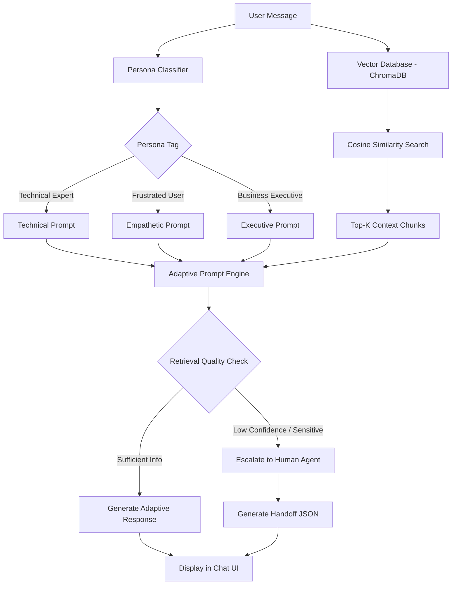

# 🤖 Persona-Adaptive Customer Support Agent

An intelligent customer support agent that adapts its response style based on the customer's communication persona. Built with Python, Google Gemini, ChromaDB, and Streamlit.

## 🏗️ Architecture



## ✨ Features

- **🎭 Persona Classification**: Automatically detects customer communication style (Technical Expert, Frustrated User, Business Executive) using Gemini structured output
- **📚 RAG Pipeline**: Retrieval-Augmented Generation using ChromaDB vector database with Gemini embeddings for grounded, factual responses
- **🎨 Adaptive Responses**: Tailored response templates matching each persona's communication preferences
- **🚨 Smart Escalation**: Automatic escalation to human agents based on low confidence, sensitive topics, or repeated frustration
- **💬 Interactive Chat UI**: Streamlit-based chat interface with real-time persona display and conversation history

## 🛠️ Tech Stack

| Component | Technology |
|-----------|------------|
| LLM | Google Gemini 2.5 Flash |
| Embeddings | Gemini text-embedding-004 |
| Vector Database | ChromaDB (Persistent) |
| Document Processing | LangChain Text Splitters + pypdf |
| Web UI | Streamlit |
| Language | Python 3.11+ |

## 📁 Project Structure

```
persona-support-agent/
│
├── data/                          # Knowledge base documents
│   ├── api_troubleshooting.md     # API auth, rate limits, endpoints
│   ├── billing_policy.txt         # Billing, refunds, disputes
│   ├── password_reset_guide.pdf   # Password reset & 2FA recovery
│   ├── account_management.md      # Profile, team, notifications
│   ├── cookie_cache_guide.txt     # Browser troubleshooting
│   ├── database_integration.md    # DB connection & performance
│   ├── uptime_sla.txt             # SLA, incident response
│   ├── email_notifications.md     # Email setup & troubleshooting
│   ├── security_best_practices.txt# Security, 2FA, encryption
│   ├── sdk_installation.md        # SDK setup guide
│   └── mobile_app_troubleshooting.txt # Mobile app issues
│
├── src/
│   ├── __init__.py                # Package initialization
│   ├── config.py                  # App configuration & thresholds
│   ├── classifier.py              # Persona detection (Gemini)
│   ├── rag_pipeline.py            # Document chunking, embedding, retrieval
│   ├── generator.py               # Persona-adaptive response generation
│   └── escalator.py               # Escalation logic & handoff reports
│
├── app.py                         # Streamlit chat UI
├── generate_pdf.py                # Helper to generate PDF document
├── requirements.txt               # Python dependencies
├── .env                           # API key (git-ignored)
├── .gitignore                     # Git ignore rules
└── README.md                      # This file
```

## 🚀 Setup Instructions

### 1. Clone the Repository

```bash
git clone https://github.com/yourusername/persona-support-agent.git
cd persona-support-agent
```

### 2. Create Virtual Environment

```bash
python -m venv venv

# Windows
venv\Scripts\activate

# macOS/Linux
source venv/bin/activate
```

### 3. Install Dependencies

```bash
pip install -r requirements.txt
```

### 4. Configure API Key

Create a `.env` file in the project root (or edit the existing template):

```
GEMINI_API_KEY="your_actual_gemini_api_key_here"
```

> 💡 Get a free Gemini API key at [Google AI Studio](https://aistudio.google.com/apikey)

### 5. Generate PDF Document

```bash
python generate_pdf.py
```

### 6. Run the Application

```bash
streamlit run app.py
```

The app will open in your browser at `http://localhost:8501`.

## 🧪 Testing Scenarios

| # | User Message | Expected Persona | Expected Behavior |
|---|---|---|---|
| 1 | *"Where is the guide to clear cookies? It's been an hour and nothing is loading on your interface!"* | **Frustrated User** | Empathize, validate inconvenience, list simple troubleshooting steps |
| 2 | *"What are the header parameter requirements for your bearer token auth implementation?"* | **Technical Expert** | Output code blocks, detailed parameters, HTTP header details |
| 3 | *"Our operational uptime is decreasing. We need a timeline of when billing disputes are resolved."* | **Business Executive** | Professional, brief, focused on timelines and business impact |
| 4 | *"I'm experiencing an issue with your database integration that's causing internal errors."* | **Technical Expert** | Retrieve docs, outline step-by-step resolution |
| 5 | *"My billing statement has unexpected duplicate charges. I demand an immediate refund!"* | **Frustrated User** | **Trigger Escalation**: Detect billing sensitivity, generate handoff JSON |

## 🔧 Configuration

Key settings in `src/config.py`:

| Setting | Default | Description |
|---------|---------|-------------|
| `GEMINI_MODEL` | `gemini-2.5-flash` | LLM model for classification and generation |
| `EMBEDDING_MODEL` | `text-embedding-004` | Model for vector embeddings |
| `CHUNK_SIZE` | 400 | Character length per document chunk |
| `CHUNK_OVERLAP` | 50 | Overlap between adjacent chunks |
| `TOP_K` | 3 | Number of retrieval results |
| `CONFIDENCE_THRESHOLD` | 0.40 | Minimum similarity score before escalation |
| `FRUSTRATION_TURN_LIMIT` | 3 | Consecutive frustrated turns before escalation |

## 📊 System Workflow

1. **User sends a message** → Chat UI captures input
2. **Persona Classification** → Gemini analyzes tone/vocabulary → Returns persona tag + confidence
3. **RAG Retrieval** → Query embedded → Cosine similarity search in ChromaDB → Top-K chunks returned
4. **Escalation Check** → Evaluates confidence threshold, sensitive keywords, frustration history
5. **Response Generation** → If safe: persona-adaptive prompt compiled → Gemini generates grounded response
6. **Escalation Path** → If triggered: empathetic message + structured JSON handoff report generated

## 📝 License

This project is for educational and demonstration purposes as part of the Adsparkx AI Assignment.
